# Hi there 👋 I'm a Software Engineer from Japan 🇯🇵, urin [ɯɾiɴ]

💻 **IT Programmer | Problem Solver | Continuous Learner**

I enjoy designing, building, and refining software systems that are **clean, scalable, and reliable**.  

> _Stats are just signals — code quality and clarity matter more._

---

## 🚀 What I Do
- 🧠 Turn complex requirements into simple, maintainable solutions  
- 🔧 Build and optimize software systems with a focus on performance  
- 📚 Constantly learn and adapt to new tools, languages, and paradigms  

---

## 🛠️ Tech Interests
- **Programming**: Strong fundamentals, language-agnostic mindset  
- **Software Design**: Clean Architecture, SOLID, readability-first code  
- **Tooling**: Automation, developer experience, productivity hacks  

## ✨ Philosophy
> **“Simple is not easy, but it is worth it.”**

I value:
- 🔍 Precision over guesswork  
- 🧪 Understanding over memorization  
- 🧩 Long-term maintainability over short-term hacks  
